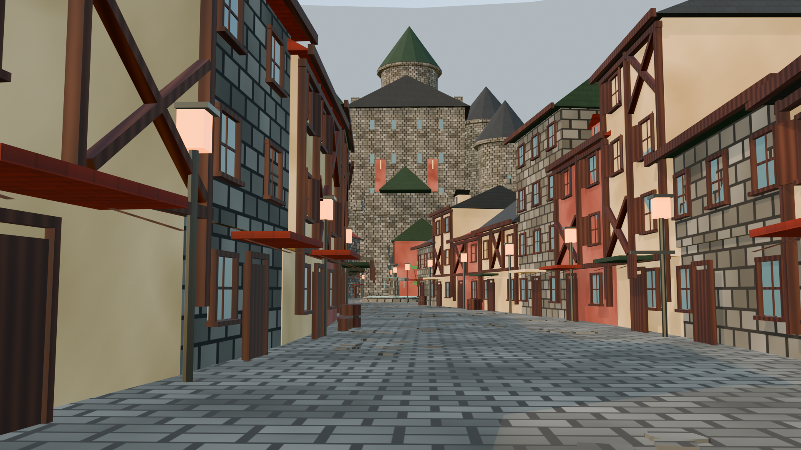
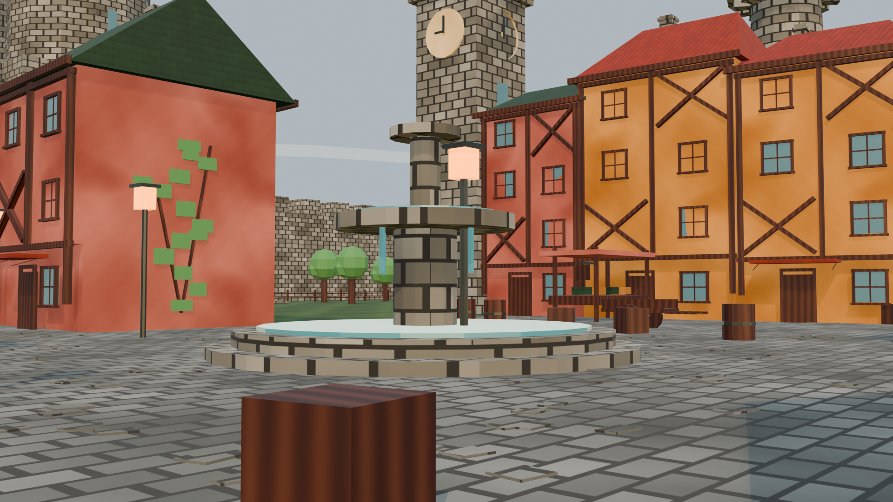
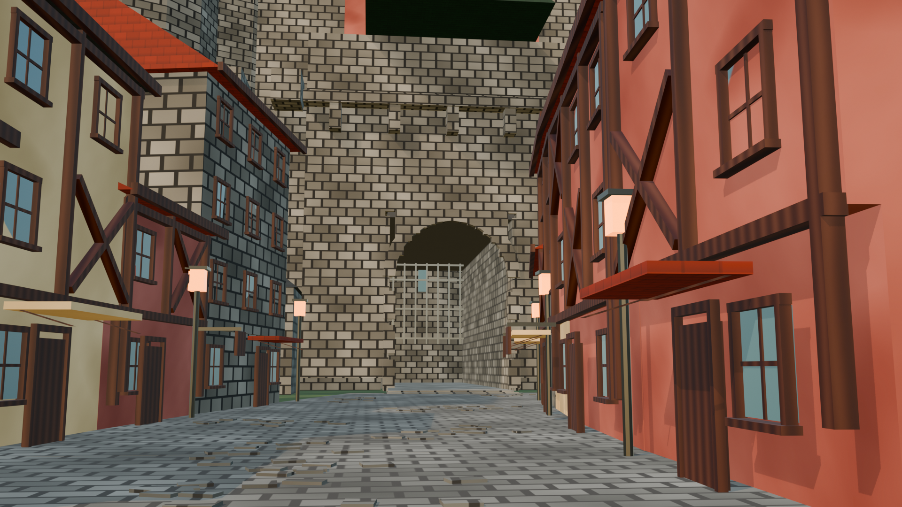
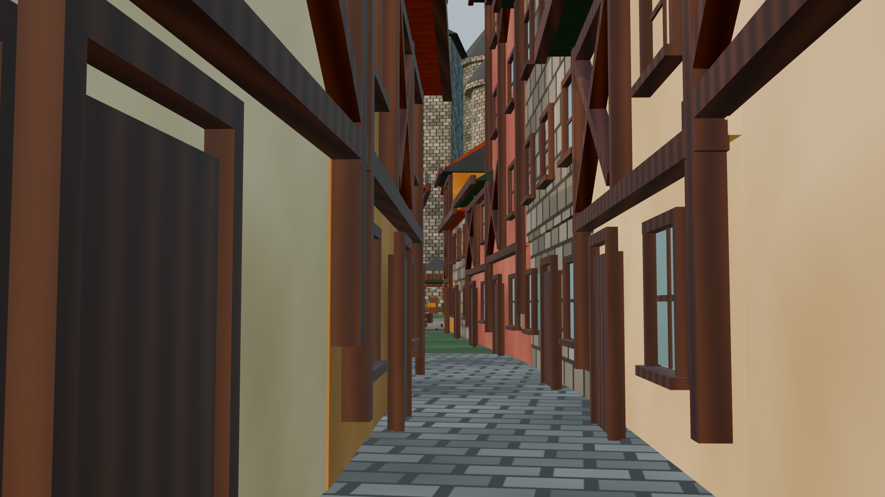
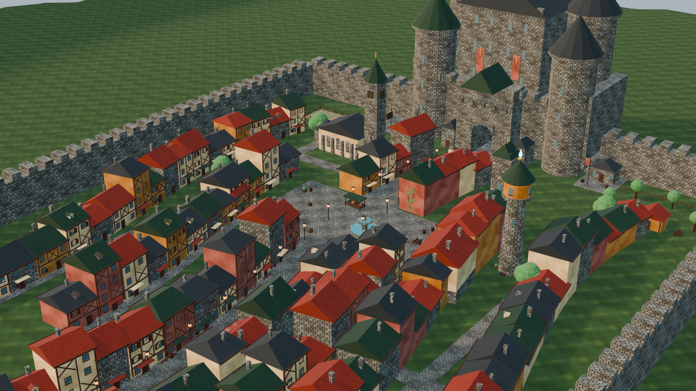
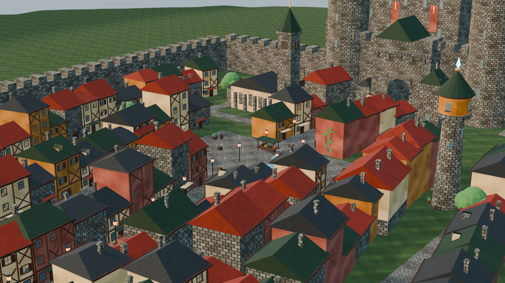
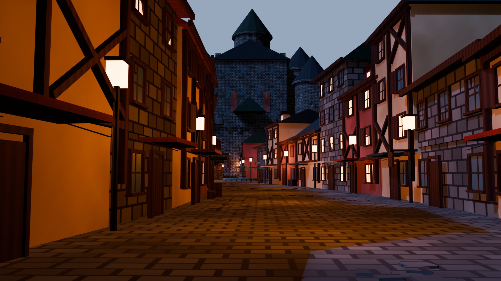
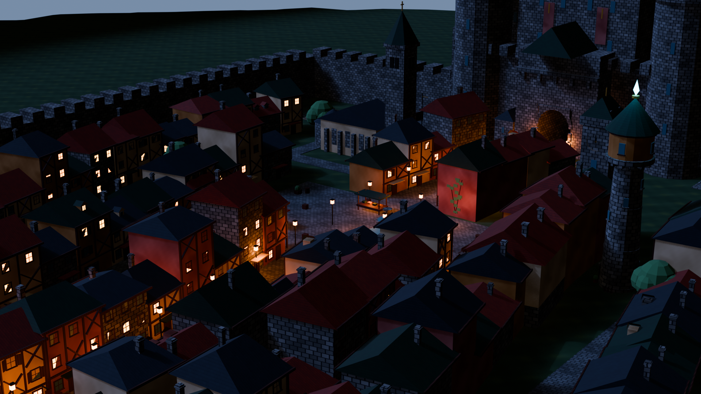

# Fantasy Castle Town — Blender Procedural Generation

Blender 5.1 ヘッドレスで**ミッドポリのファンタジー城下町**をプロシージャル生成するプロジェクト。
Unity 等のゲームエンジンで「歩ける街」として使うことを想定した FBX / GLB を出力します。

**制作体制**: Claude (Claude Code) と Codex が実装とレビューを交代しながら制作。
テクスチャはダウンロード素材を使わず、**全て numpy でプログラム生成** (石畳・漆喰・石壁・瓦3色・木目・草地)。

📄 **[まとめページ (docs/summary.html)](docs/summary.html)** — 制作過程・バージョン別スクリーンショット付き

## スクリーンショット

| 大通り (一人称 1.6m) | 市場広場 |
|---|---|
|  |  |

| 城門前 | 路地 |
|---|---|
|  |  |

| 俯瞰 | クォータービュー |
|---|---|
|  |  |

### 夕暮れモード (`TOWN_DUSK=1`)

| 大通り | 俯瞰 |
|---|---|
|  |  |

## 実行方法

```bash
"C:\Program Files\Blender Foundation\Blender 5.1\blender.exe" -b --factory-startup -P scripts/generate_town.py
```

- 約6秒で完走 (シード固定・再現可能)。`TOWN_TEST=1` で軽量テストモード。
- 出力: `renders/*.png` (6視点)、`export/town.glb` (テクスチャ同梱)、`export/town.fbx` (+隣接PNG)、`export/town.blend`
- 約36万 tris。コレクション: Castle / Town / Walls / Props / Ground / Environment

## 街の構成

- 中央奥の**城** (主塔61m・円筒塔5基・胸壁・門アーチ) と城郭
- 城門へ続く**約180mのS字カーブしたメインストリート** (連続ファサードが接線に沿って追従)
- **市場広場** (段付き噴水・屋台4・樽・木箱・街灯)
- 幅3mの**路地**、外周**城壁** (南門つき)
- 第二ランドマーク: **教会** (鐘楼+アプス+バットレス)、**時計塔**、**魔法使いの塔** (発光クリスタル)
- 城前庭に菜園・果樹園・作業小屋の生活ゾーン、城内郭に中庭・衛兵詰所・旗竿
- 南門外: 川と**石橋**、畑、農家、**風車**のアプローチ景観、**川港** (桟橋・ボート・倉庫・クレーン)
- 広場そばに**宿屋・酒場** (吊り看板・屋外席)、妻壁に蔦・バナー・トレリス装飾
- **ターンテーブル動画**: [renders/turntable.mp4](renders/turntable.mp4)（`TOWN_TURNTABLE=1` で生成）
- 遠景: 連続稜線の山なみ (雪頂つき)・霞リング

## Unity 取り込みメモ

- 1 unit = 1m、メッシュのみの FBX (カメラ・ライト除外済み)
- 各メッシュは使用マテリアルのみ登録 (サブメッシュ削減済み)
- `Ground_Cobblestones` (散布した浮き石) は Collider 対象外推奨。歩行判定は平らな路面へ
- 背景 (`Environment_DistantMountains` 等) は別レイヤー/Prefab 推奨 (Bounds が大きいため)
